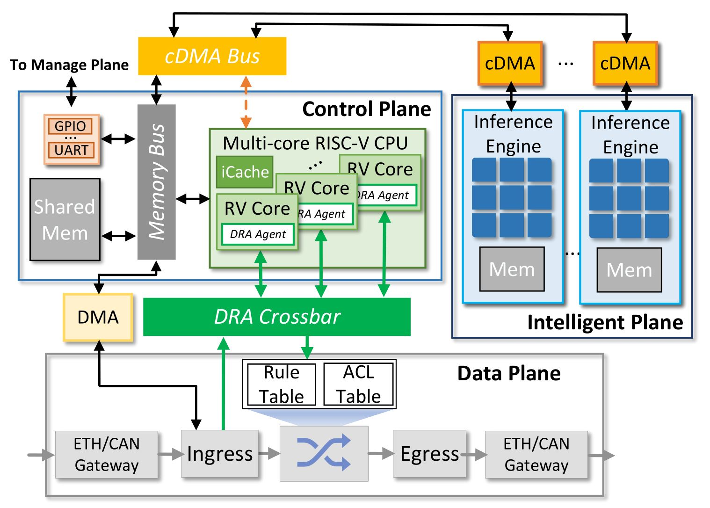

# DP4C: A SoC Architecture for NN-driven Network Functions with the Intelligent Plane

<div style="text-align: justify">
DP4C comprises the programmable NN inference engine that iteratively executes
inference to ensure model generality in the intelligent plane, a
multi-core RISC-V CPU that parses inference results into diverse
network functions through its architectural flexibility in the
control plane, and the switch fabric in the data plane. To further
eliminate the performance bottleneck, we propose (i) the direct
register access mechanism coupled with custom instructions to
reduce the overhead of cross-plane data migration; and (ii) the
multi-core pipelining with adaptive batch-processing for multi-
core CPU. 
</div>
<p></p>

<div align=center>

</div>

## Code Structure 

```plaintext
TinyLEO toolkit/
├── docs/                      # Documentation files
├── FL-M32_src/                # Source code of DP4C
├── FL-M32_Runtime/            # The software runtime environment of DP4C SoC
├── FL-M32_Remote_Controller/  # Used to configure DP4C instruction by Network
├── FL-M32_simNIC/             # The hardware simulation environment for DP4C SoC
└── README.md                  # This file
```

## Overview

Our DP4C toolkit integrates the intelligent, control, and data planes in a single chip:
DP4C SoC introduces and implements the concept of the intelligent plane with
three key components. First, it incorporates a novel intelligent
plane with programmable RTC NN inference engines that
iteratively execute inference to ensure model generality, and a
configurable DMA (cDMA) module optimized for inference-
specific data migration. Second, the control plane integrates a
multi-core RISC-V CPU that exploits architectural flexibility
to dynamically execute network operations through runtime
translation of inference results. Third, an essential switch
fabric is designed in the data plane for traffic forwarding.

<div align=center>

</div>


<!--## How to Cite DP4C?

Please use the following BitTex file when citing TinyLEO:

```bibtex
@inproceedings{DP4C,
  author  = {Dong Wen, Tao Li, Wenwen Fu, Chenglong Li, Zhuochen Fan, Hui Yang, Chao Zhuo, Lun Li, Zhiting Xiong, Junnan Li},
  title   = {DP4C: A SoC Architecture for NN-driven Network Functions with the Intelligent Plane},
  booktitle={IEEE TRANSACTIONS ON COMPUTER-AIDED DESIGN OF INTEGRATED CIRCUITS AND SYSTEMS},
  year    = {2025},
}
```
-->

## License

DP4C toolkit is released under the [Apache 2.0 license](LICENSE).


```
Copyright 2025 DP4C

Licensed under the Apache License, Version 2.0 (the "License");
you may not use this file except in compliance with the License. 
You may obtain a copy of the License at

   http://www.apache.org/licenses/LICENSE-2.0

Unless required by applicable law or agreed to in writing, software
distributed under the License is distributed on an "AS IS" BASIS,
WITHOUT WARRANTIES OR CONDITIONS OF ANY KIND, either express or implied.
See the License for the specific language governing permissions and
limitations under the License.

```
